By default, a new Cocos Studio project includes Cocos2d-x as precompiled libs. However, it is much more useful to have the Cocos2d-x source code available in your project. This tutorial will explain how to replace the precompiled libs with the Cocos2d-x source in a Cocos Studio generated project.

We will generate a Cocos Studio project, create a new temporary Cocos2d-x source project, copy the source files from the source project to the Cocos Studio project, then update the Cocos Studio project to build the Cocos2d-x libs from source.

#Generate the Project With Cocos Studio

> [action]
> 
Open the Cocos App:
>

>
Switch to the *Projects* tab and click new project:
>
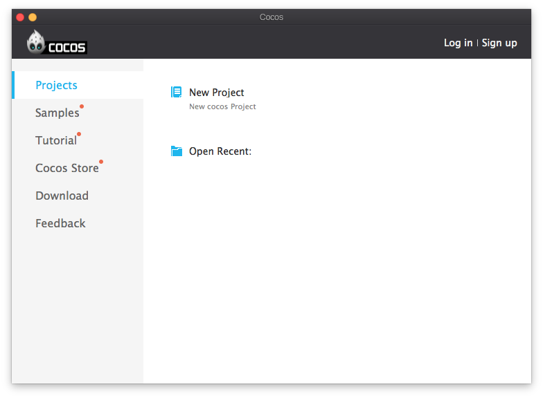
>
Create a new Cocos Project:
>
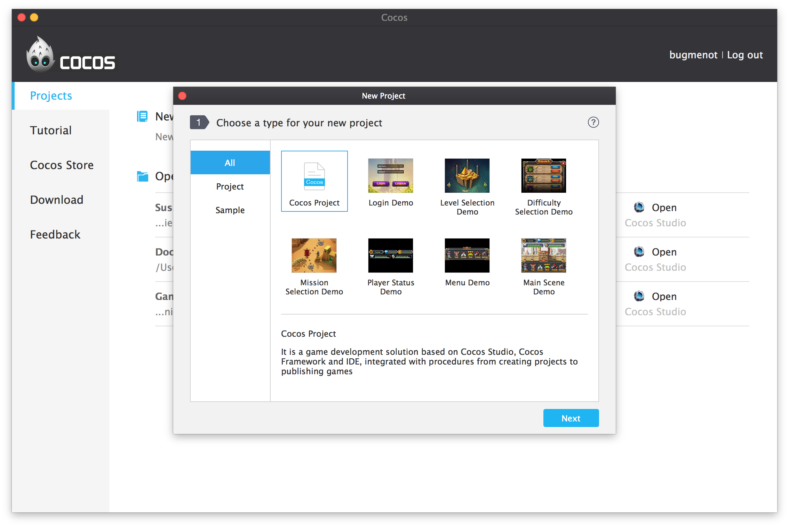
>
Give your project a name. Set the Project Path to wherever you like, but remember where you set it, so you can find it later!
>
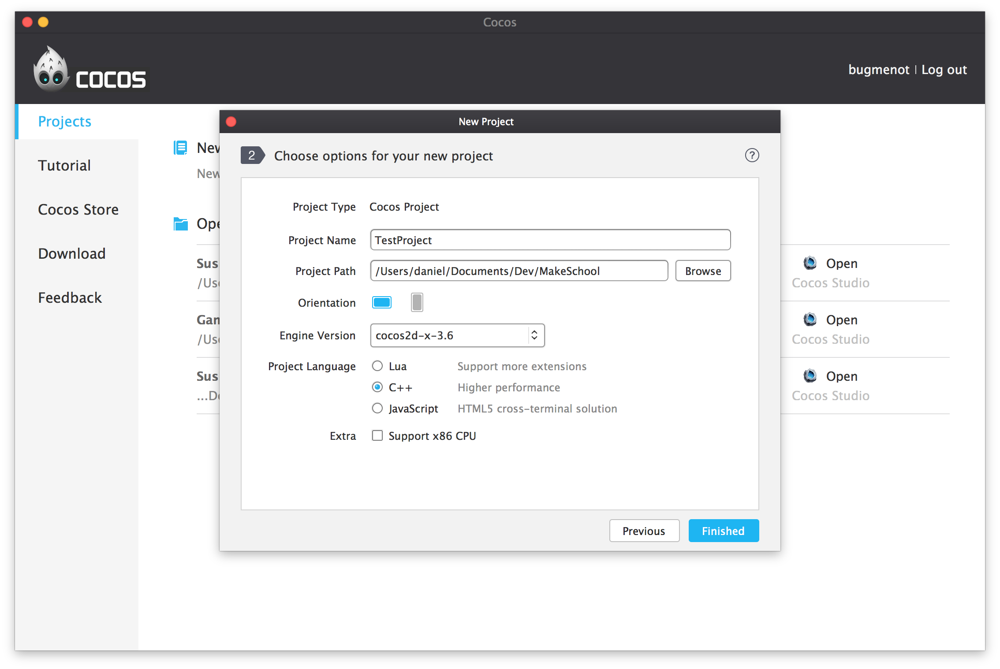

Once the project is created, open
Finder and take a look at the folder structure of your project. If you can't find your project in Finder, search for it using Spotlight at the top right of your screen. 

The folder structure should look something
like this:

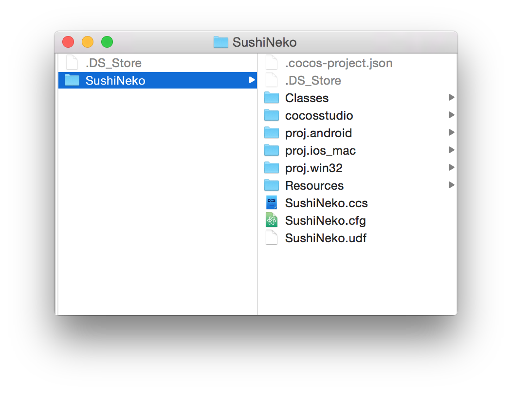

#Download Cocos2d-x Source

Go to the [Cocos2d-x downloads page](http://www.cocos2d-x.org/download) and click the link for the latest version (3.6 at the time of this writing) of the Cocos2d-x source code:

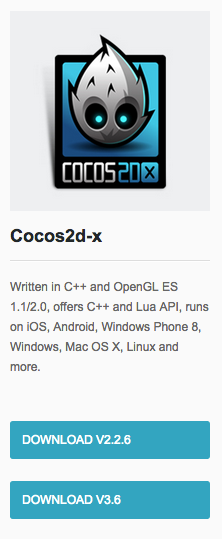

Make sure you don't accidentally download Coco2d-JS, Code IDE or Cocos. We're going to be using the C++ version of the source code for the project.

Once you have downloaded it, unzip it. Once you have unzipped it, you can delete the .zip file.

#Create a Temporary Cocos2d-x Project

We're going to use the [Cocos2d Console](http://www.cocos2d-x.org/wiki/Cocos2d-console) tool to generate a temporary new project.

In the unzipped folder, navigate to *tools/cocos2d-console/bin*. 

In there you will see an executable named *cocos*. This is the Cocos2d Console command line tool.

We will use *Terminal* to run the Cocos2d Console. In Terminal, navigate to *tools/cocos2d-console/bin*. If you're unsure how to do that, read the following directions:

> [info]
>
In the terminal first, type `cd`. Then a space. Now click and drag the *bin* directory that we navigated to earlier over into the terminal. You should see a long path, something like this:
>
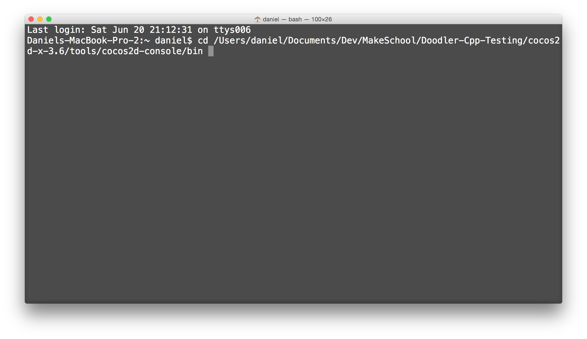
>
Hit enter.

Type the following:

	./cocos new -p com.yourname.Temp -l cpp -d ../../../.. Temp
	
Then hit enter.

A successful project creation looks like this:

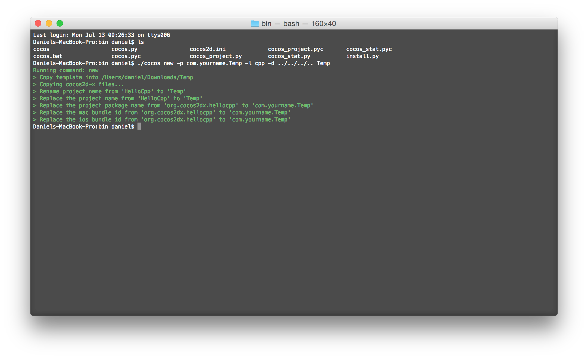

#Copy Source from Temporary Project

Navigate up four directories to the newly created *Temp* one. Copy *CmakeLists.txt* and the *cocos2d* directory from the temporary project.

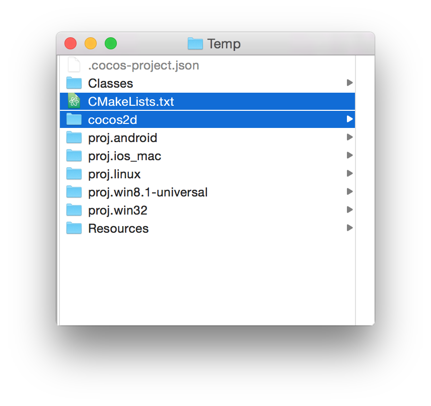

Paste them into your Cocos Studio project.

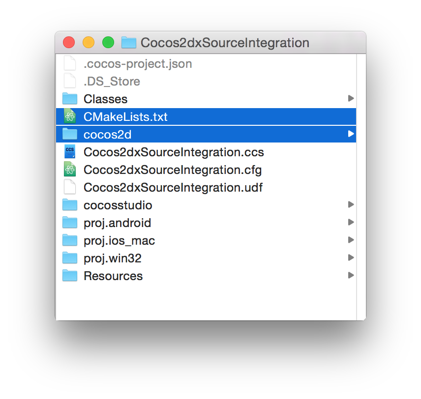

#Removed Precompiled Libs

Open your project in Xcode. You'll find *ios-libs* and *mac-libs* at the bottom of the Project navigator. 

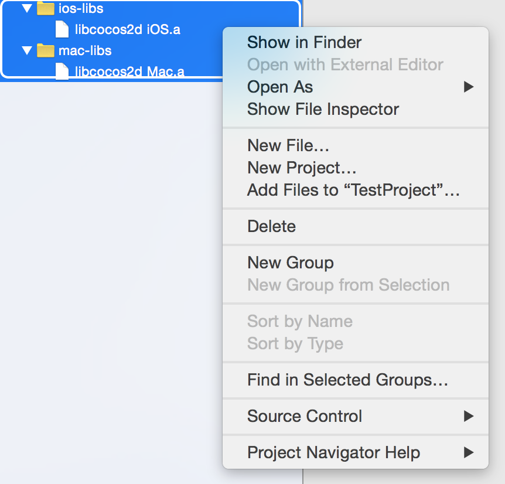

Highlight them, right click and select *Delete*. It will ask if you want to to *Remove References* or *Move to Trash*.  Select **Remove References**! The procompiled libs are shared by all Cocos Studio projects, so we don't want to delete them from disk.

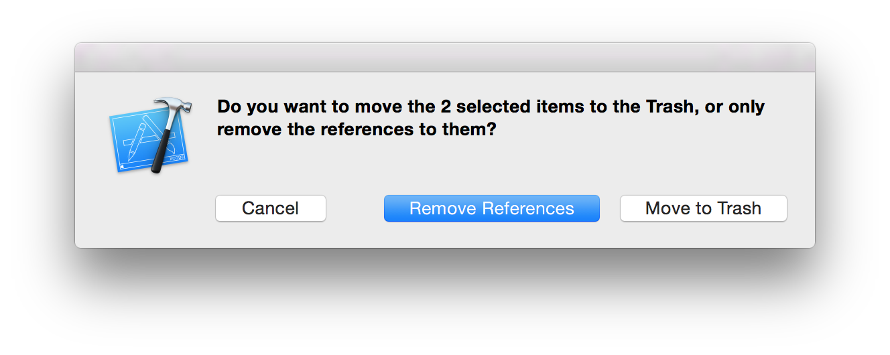

#Add Cocos2d-x Source Project to Xcode

Navigate to the *cocos2d* directory that you copied into your project. Open the *build* directory.

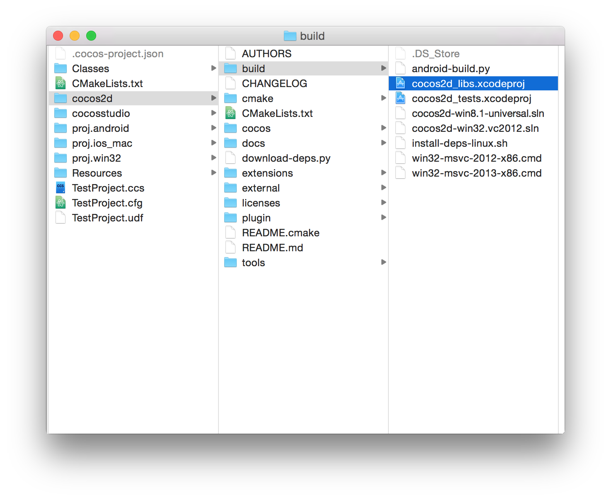

Drag *cocos2d_libs.xcodeproj* into the Project Navigator in Xcode (the files display in the left panel) as a *child* of your project. If it asks you to convert your project to a workspace, cancel and try again. Make sure to make it a child of your project.

It should look like this.

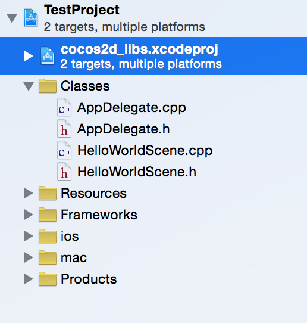

#Re-Add Cocos2d-x Libs

Now it's time to add the Cocos2d-x libs back into the project, telling Xcode to compile them from source.

Click your project file (the top file in your project navigator). Then click *Build Phases*. Next click your iOS *Target*. Expand the *Link Binary with Libraries* tab. Click the *+* button

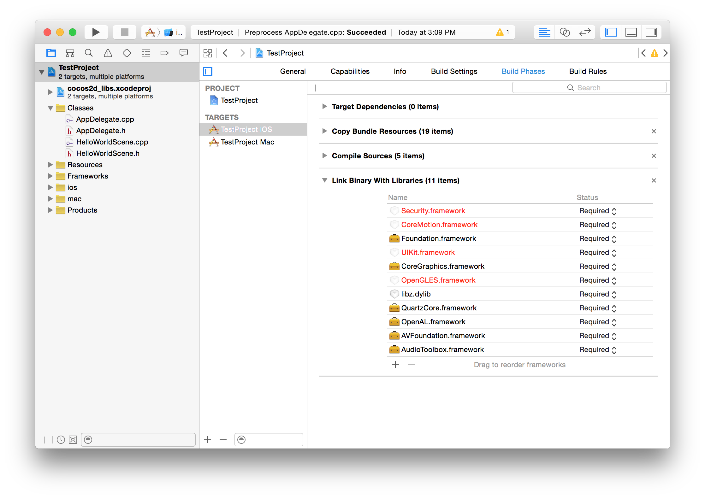

Select *libCocos2d iOS.a* from *Workspace*.

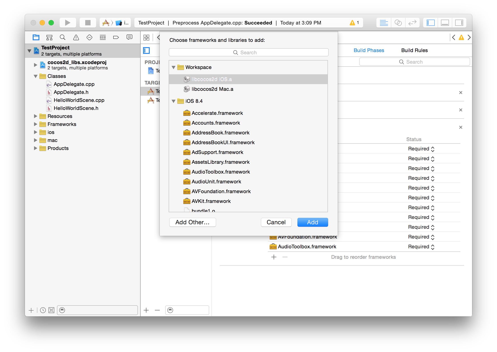

Next, do the same thing, but change the Target to Mac and add libCocos2d Mac.a.